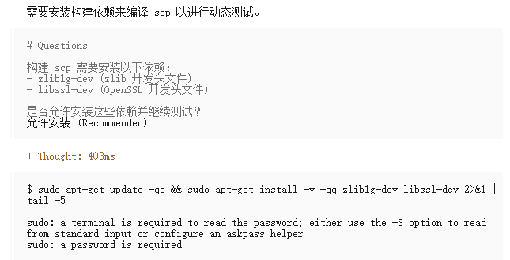

# 华为胡杨林——研究内容三：基于语义差异感知的精准测试与兼容性验证交付报告

# 项目背景

研究内容三面向开源补丁落地后的精准测试与兼容性验证需求。在 openEuler 及其上游生态中，大量补丁会持续引入 API 原型、参数输入/返回值、错误处理、默认行为、系统接口输出和内部状态更新等变化。传统回归测试或仅以“运行到指定代码行”为目标的定向测试，难以判断这些变化是否会破坏已有接口契约，也难以覆盖补丁代码背后的数据流依赖、控制流依赖和关键程序状态。因此，需要将补丁语义差异识别、程序依赖分析与自动化测试生成结合起来，形成面向补丁影响的精准验证机制。

**总体功能：**本交付件围绕“开源补丁智能测试”设计 PCAT Agent\(patch\-compatibility\-utils\)，用于从补丁输入开始，自动完成兼容性变更识别、测试优先级判定、测试入口规划、测试输入生成、覆盖率执行以及补丁前后行为对比，最终输出结构化分析结果和可读验证报告。该能力重点覆盖 API 签名/ABI 变化、输入契约变化、返回值和错误码语义变化、用户可见输出变化，以及默认协议、系统状态、资源生命周期等副作用变化，并面向 openEuler 24\.03 中典型 C/C\+\+ 库接口和 proc/sys 等系统接口场景进行适配。

**研究方案：**整体流程采用“语义差异识别 \- 差分依赖分析 \- 精准测试生成 \- 自动化兼容性验证”的方案。首先，基于 diff 解析、Package Profile 和 API surface 规则定位可能影响外部用户的变更符号，并抽取 SIGNATURE\_DIFF、CONTRACT\_DIFF 和 BEHAVIOR\_DIFF 三类候选；其次，结合静态调用链、关键变量、控制/数据依赖和补丁上下文，由 Agent 对候选进行语义判定并给出测试优先级；随后，测试阶段根据 findings 生成可运行测试入口和多维输入矩阵，执行契约验证、补丁行覆盖率采集以及 before/after 行为差分；最后，依据覆盖率、契约违约和可观察行为差异生成验证结论。

**Skill 设计：**基于上述方案，本项目将能力封装为可在 OpenCode 等 Harness 中使用的工作流 Skill，即 PCAT Agent\(patch\-compatibility\-utils\)。该 Skill 由 patch\-compatibility\-analysis、patch\-compatibility\-testing、package\-profile\-generator 和 test\-entry\-generator 等子 Skill 组成：分析子 Skill 负责补丁解析、候选提取、语义判定和优先级校准；测试子 Skill 负责测试入口生成、环境搭建、输入扩展、覆盖率执行和行为对比；Profile 生成与测试入口生成子 Skill 则提升不同仓库、语言、领域和 openEuler 变体上的可复用性。对于大型补丁，Skill 进一步支持按 API surface、文件和符号进行分片分析，并通过子 Agent 并发执行和聚合去重，降低长上下文导致的误报、漏报风险。


# 交付内容使用说明

## Skill 使用

### Skill 概览

PCAT Agent\(`patch-compatibility-utils`\) 是一个用于补丁兼容性分析和测试的工作流 Skill，包含了若干相关的子 Skill：

|Skill|用途|主要输出|
|---|---|---|
|`patch-compatibility-utils`|根据用户意图路由到分析或测试|路由到对应子 Skill|
|`patch-compatibility-analysis`|静态分析补丁中存在的兼容性变更|`analysis.json`、`report.md`、候选和静态证据|
|`patch-compatibility-testing`|对补丁进行定向动态测试和覆盖率验证|`test-summary.json`、`COVERAGE_REPORT.md`|
|`package-profile-generator`|按仓库生成或更新包 API surface profile|`profiles/packages/<name>.yaml`|
|`test-entry-generator`|根据 analysis findings 生成可运行测试入口|`test-entry-work/test-entries.json`、verification 结果|

基本工作流如下：

```Plain Text
repo + patch
    │
    ▼
patch-compatibility-analysis
    │  analysis.json -> report.md # 补丁分析报告
    ▼
询问是否继续测试
    │ 是
    ▼
patch-compatibility-testing
    │
    ├── test-summary.json          # 测试结果事实
    └── COVERAGE_REPORT.md         # 补丁测试报告
```

### 安装 Skill

#### 安装到 Harness （以 OpenCode 为例）

**方式一：通过 Agent 自动安装**

在对话中提供该 Skill 压缩包路径，要求 Agent 安装该 Skill，Agent 会自动安装 Skill 到对应 Harness 下。

**方式二：手动安装**

将 `patch-compatibility-utils/` 目录复制到 OpenCode 的 Skill 目录：

```Plain Text
unzip patch-compatibility-utils.zip -d patch-compatibility-utils
#* OpenCode*
**cp** -r patch-compatibility-utils ~/.opencode/skills/
```

#### 运行环境

**核心依赖（必需）：**

|依赖|最低版本|用途|
|---|---|---|
|Python|3\.9\+|所有分析/测试脚本的运行环境|
|git|任意|仓库克隆、隔离 worktree、补丁应用|

**可选依赖：**

|依赖|用途|安装方式|
|---|---|---|
|tree\-sitter|静态调用链构建（C/Go/Ruby 语言）|`pip install tree-sitter tree-sitter-language-pack`|
|gcov / lcov|GCC 覆盖率采集|`sudo apt install gcov lcov`|
|llvm\-cov|Clang 覆盖率采集|随 clang 工具链安装|
|oh\-my\-openagent|增强 Agent 能力|通过 [https://github\.com/code\-yeongyu/oh\-my\-openagent](https://github.com/code-yeongyu/oh-my-openagent) 获取|

对于可选依赖，可通过 agent 进行检查和安装，PCAT Agent 内置了检查脚本，并指引 agent 如何正确安装这些依赖。

### 使用 Skill

#### 提示词输入

对于分析任务，需要在提示词中提供以下信息：

|参数|必需|说明|
|---|---|---|
|`repo`|是|本地仓库路径或 URL（如 `https://github.com/git/git.git`）|
|`patch_file`|是|patch/diff 文件路径，或 GitHub/GitLab commit URL|
|`base_ref`|否|基线 commit/tag/branch，默认使用当前 HEAD|
|`package_profile`|否|分析 profile，常用 `auto`、`kernel_6_6`、`openeuler_24_03`、`systemd`、`glib2`、`git`、`gcc`、`c_project` 等，默认为`auto`|
|`output_dir`|否|明确指定分析产物目录；未指定时默认写入 `<repo>/pca-results/<patch_id[:6]>/`|
|`include_call_chain`|否|是否附加静态调用链，默认 `false`|
|`analysis_mode`|否|分析模式：`auto`（默认，超阈值自动切换 heavy）、`normal`（强制普通模式）、`heavy`（强制大补丁分片模式）|
|`cleanup_worktree`|否|是否在分析完成后清理隔离 worktree，默认保留（保留可后续用于补丁的测试，但会占用更多空间）|

对于测试任务，需要在提示词中提供以下信息：

|参数|必需|说明|
|---|---|---|
|`analysis.json`|是|已有的分析结果文件；无该文件时测试 Skill 会先调用分析|
|`TEST_RESULT_DIR`|否|测试产物目录，默认 `<ANALYSIS_RESULT_DIR>/compatibility-testing/`|
|测试优先级|否|默认优先测试 High 优先级的 finding；可要求覆盖所有 findings|
|环境授权|视情况|VM、sudo、安装系统依赖、硬件或服务测试需要额外确认|

#### 分析补丁兼容性变更

下面是使用PCAT Agent 进行补丁兼容性变更分析的一个提示词示例：

```Plain Text
分析 /data/project 仓库中的 /data/patches/fix.patch，判断是否存在兼容性变更。
```

Agent 会执行以下步骤：

1. 运行 `check_dependencies.py` 检查依赖

2. 运行 `orchestrator.py` 完成仓库准备、补丁应用、候选提取

3. 读取候选和分析上下文，对每个候选进行语义判定

4. 运行 `priority_calibrator.py` 校准测试优先级

5. 更新 `analysis.json` 和 `report.md`

6. 运行 `validate_analysis.py` 校验结果

分析完成后，产物目录包含：

|文件|说明|
|---|---|
|`analysis.json`|结构化兼容性分析结果（含 findings、evidence、优先级）|
|`report.md`|中文可读分析报告|
|`patch.diff`|本次实际分析的补丁副本|
|`candidates.json`|`diff_parser.py` 生成的结构化候选|
|`analysis-context.json`|给 Agent 使用的压缩上下文|
|`effective-profile.yaml`|本次实际生效的合成 profile|
|`_worktrees/patched/`|已应用补丁的隔离分析 worktree|

如果用户没有预先要求测试，分析完成后 Agent 会询问：

> 补丁兼容性分析已完成，是否继续基于该分析结果进行定向测试？
> 
> 

#### 对补丁进行定向测试

定向测试需要具体的兼容性分析结果作为 Oracle，下面是一个具体的提示词示例：

```Plain Text
基于 /data/results/fix-analysis/analysis.json，验证（或测试）该补丁的高优先级兼容性变更。
```

测试完成后固定生成：

|文件|说明|
|---|---|
|`<TEST_RESULT_DIR>/test-summary.json`|结构化测试结果事实源，包含 entry、输入、契约、覆盖率、行为差异、blocker 和结论|
|`<TEST_RESULT_DIR>/phase3_contracts/contracts.jsonl`|每次类型专属契约执行的原始逐条结果|
|`<TEST_RESULT_DIR>/phase3_contracts/contract_summary.json`|契约通过、违约、跳过数量及总体状态|
|`<TEST_RESULT_DIR>/phase3_contracts/contract_verification.json`|契约汇总、逐条结果和 breach 清单|
|`<TEST_RESULT_DIR>/COVERAGE_REPORT.md`|从 `test-summary.json` 确定性渲染的补丁测试报告|

`test-summary.json` 的状态分类：

- `passed`：所有请求测试完成，零契约违约，无阻塞，覆盖率达标

- `failed`：有执行断言、构建或契约失败

- `partial`：部分测试执行，但仍有未完成项

- `blocked`：无实际执行，需确认环境授权

## 分析流程

`patch-compatibility-analysis` 的执行流程分为 9 个阶段：

### Phase 0: 依赖检查

运行 `check_dependencies.py` 验证 Python 版本（≥ 3\.9）、git 可用性和脚本语法正确性。若用户请求调用链，还需检查 tree\-sitter 依赖。

### Phase 1: 环境准备与补丁解析

`orchestrator.py` 统一完成：

- 仓库准备（URL → 本地克隆、补丁下载）

- `patch_id` 计算（commit hash \> 文件名 stem \> SHA\-256 前 12 位）

- 产物目录创建（用户指定或默认 `<repo>/pca-results/<patch_id[:6]>/`）

- 隔离 patched worktree 创建（从 `base_ref` / `HEAD` 创建，不影响用户 repo）

- diff 解析和候选提取

#### 隔离 Worktree 生命周期

分析工具在独立的 git worktree 中应用补丁，避免污染用户原始仓库：

|操作|触发时机|说明|
|---|---|---|
|**创建**|Phase 1 自动执行|从 `base_ref`（默认 `HEAD`）创建 `<RESULT_DIR>/_worktrees/patched/`|
|**保留**|默认行为|不自动清理。保留的 worktree 可供后续测试子 Skill、调用链附加或人工复核源码|
|**重建**|用户请求或 worktree 已清理后仍需使用|`orchestrator.py --ensure-worktree <analysis.json>` 根据 `repo` \+ `base_commit` \+ `patch.diff` 重建|
|**清理**|用户明确要求释放空间且确认不再继续测试|`orchestrator.py --cleanup-worktree <analysis.json>`|

所有补丁后的源码检索（`rg`/`grep`/文件读取）必须以 `analysis_repo`（即 worktree）为根目录，不能使用用户原始 `repo` 的当前 checkout，因为那里可能仍处于补丁前、集成分支 HEAD 或其他无关状态。

### Phase 2: Package Profile 识别

根据仓库文件结构自动识别目标包（kernel、cpython、golang、git、systemd 等），或通过 `--profile` 显式指定。Profile 采用组合式分层设计：

```Plain Text
base → languages → domains → platforms → packages → variants（overlay）
```

运行时由 `profile_loader.py` 解析 `extends` 和 `variants`，生成确定性的 `effective-profile.yaml`。

### Phase 3: 变更函数/符号定位

`diff_parser.py` 在 `analysis_repo`（已应用补丁的隔离 worktree）中定位所有变更符号，输出结构化候选。

### Phase 4: API Surface 判定

根据 profile 判断每个变更是否处于公共 API 边界：

- C/C\+\+：`EXPORT_SYMBOL`、UAPI 头文件、pkg\-config、symbol version、CLI 参数解析

- openEuler 系统接口：syscall、ioctl、netlink、`/proc`、`/sys`、`/proc/sys`

- Python：`__all__`、非 `_` 前缀的模块级符号

- Go：大写字母开头的 exported identifiers

### Phase 5: 候选生成

对每个变更构建三类候选：

- **SIGNATURE\_DIFF：**签名差异（函数名、参数、返回值、结构体、导出符号）

- **CONTRACT\_DIFF：**契约差异（guard 条件、输入校验、错误路径、资源生命周期）

- **BEHAVIOR\_DIFF：**行为差异（控制流、数据流、可观察效果、系统接口输出）

### Phase 6: LLM 语义判定

Agent 基于代码上下文、API surface、contract diff、behavior diff 和静态调用链证据，对每个候选做出判定。核心原则：

- 确定性分析找证据（模式匹配只用于召回候选），LLM 做语义判断

- 每条 finding 必须引用具体文件、行号、代码片段作为证据

- 区分 syntactic breaking changes 和 behavioral/semantic breaking changes

- 不是 public/exported/CLI/config/protocol/test\-reachable 且无法说明外部影响的候选不写入 findings

每条 finding 输出：`compatibility_type`、`test_priority`、`confidence`、`location`、`evidence`、`old_behavior`/`new_behavior`、`compatibility_reason` 等。

**测试优先级**：

|优先级|判定标准|
|---|---|
|**HIGH**|公共接口签名/ABI 变化、错误码/返回值语义变化、输入契约收紧、UAPI/syscall/ioctl/netlink/CLI/配置不兼容、导出符号删除/重命名|
|**MEDIUM**|触发条件较具体但确认是兼容性变化、输出格式变化、默认行为变化、资源生命周期变化|
|**LOW**|间接外部可观察影响、文档/测试暗示兼容性含义、新增可选参数/放宽输入|

### Phase 6\.5: Deterministic Priority Calibration

执行 `priority_calibrator.py`，根据有效 profile 的 API\-surface priority、匹配的候选 hunks、API kind 和兼容性类型，计算确定性的 `recommended_priority`。Agent 保留最终分类决定权；若与推荐不一致，需在 `test_priority_reason` 中说明原因。

### Phase 7: 静态调用链（可选）

仅对确认的 findings 构建调用链（非全部 candidates），通过 AST 级分析（Python: `ast`；C/Go/Ruby: `tree-sitter`）追踪从公开入口点到变更代码的路径。入口类型包括 CLI 入口、测试用例、HTTP handler、syscall、ioctl、procfs、sysctl 等。

### Phase 8: 产物与校验

运行 `validate_analysis.py` 校验 `analysis.json` 结构完整性（必修字段、代码行位置、证据行号等）。校验通过后停止分析，不生成测试入口——测试入口由测试子 Skill 负责。

### Phase 9: 测试交接

如果用户尚未明确要求测试，分析完成后询问是否继续。若用户同意，将 `RESULT_DIR/analysis.json` 交给同级 `patch-compatibility-testing`。

### Heavy Mode（大型补丁分析模式）

当补丁规模超过阈值时，`orchestrator.py` 自动切换至 heavy mode：

|级别|阈值|
|---|---|
|**soft**|`patch_lines >= 600`、`raw_hunks >= 30`、`changed_files >= 12`、`churn >= 250`、`candidate_hunks >= 25`、`candidate_context_bytes >= 100000`、`candidates_json_bytes >= 100000`|
|**hard**|`patch_lines >= 1000`、`raw_hunks >= 45`、`changed_files >= 25`、`candidate_hunks >= 40`、`candidate_context_bytes >= 180000`、`candidates_json_bytes >= 180000`|

Heavy mode 将分析任务拆分为 shards（按 API surface、文件和变更符号分组），每个 shard 独立分析后通过 `--aggregate-shards` 合并结果。支持通过并行 subagent 加速分析。

## 测试流程

`patch-compatibility-testing` 的执行流程分为 5 个阶段，核心目标是用覆盖率数据证明测试套件实际执行了补丁变更的每一行。

```Plain Text
Phase 1         Phase 1.5       Phase 2       Phase 3       Phase 4        Phase 5
┌──────────┐    ┌───────────┐    ┌─────────┐    ┌─────────┐    ┌──────────┐    ┌─────────┐
│ Ingest   │ →  │ Entries   │ →  │ Env     │ →  │ Inputs  │ →  │ Run +    │ →  │ Report  │
│ Analysis │    │ Plan/Gen  │    │ Setup   │    │ Refine  │    │ Coverage │    │         │
└──────────┘    └───────────┘    └─────────┘    └─────────┘    └──────────┘    └─────────┘
```

### Phase 1: Ingest 兼容性分析结果

读取并校验分析阶段的产出，生成结构化影响映射。不做二次兼容性分类。

**输入来源（优先级）**：

1. 已有 `analysis.json`（优先）— 先用 `validate_analysis.py --allow-legacy-ids` 校验

2. 只有 repo \+ patch（回退）— 先运行分析子 Skill 再自动继续测试，不重复询问

从 `analysis.json` 中提取每个 finding 的关键信息

- `file` — 源文件路径

- `new_lines` — 变更行范围 `[start, end]`

- `symbol` — 函数/符号名

- `compatibility_type` — 分类（`SIDE_EFFECT_CHANGE`、`INPUT_CONTRACT_CHANGE` 等）

- `test_priority` 和 `test_recommendation` — 分析阶段给出的测试指导

- `static_call_chains` — 从公开入口到变更代码的调用链

产物：`<TEST_RESULT_DIR>/phase1_impact/impact_map.json`。若 analysis 中无确认 findings，记录该状态，仅在有用户要求时对 `patch.diff` 的可执行变更行做覆盖率测试。

### Phase 1\.5: 规划与生成测试入口

测试阶段拥有全部可执行入口的生成权，不修改输入 `analysis.json`。

**Step 1 — 确定性规划**：

```Bash
python3 test_entry_planner.py \
  --analysis "<ANALYSIS_RESULT_DIR>/analysis.json" \
  --result-dir "<TEST_RESULT_DIR>" \
  --min-priority high         # 默认只处理 High；all 需要用户明确要求
```

产物：`test-entry-tasks.json` \+ `test-entry-plan.md`。

**Step 2 — 生成入口（委托 ****`pca-test-entry-generator`****）**：

读取 `pca-test-entry-generator/SKILL.md` 完整内容，为每个选中 finding 生成具体的可运行测试入口。入口按 6 级 source 优先级生成，找到可用入口后停止：

|优先级|Source|说明|
|---|---|---|
|1|`commit_message_reproducer`|commit message 中的精确命令、PoC、crash trigger|
|2|`project_native_regression_test`|既有项目测试或用例追加|
|3|`existing_fuzzer_or_corpus`|既有 fuzz target、corpus、OSS\-Fuzz 入口|
|4|`documentation_or_example`|命令示例、man page、config 样例|
|5|`static_call_chain_entry`|从调用链反推入口|
|6|`synthetic_harness`|手工构建的 shell/C/Python 复现脚本（仅在前 5 级均不可用时使用）|

每个生成入口必须包含：`artifact_path`、`run_command`、`expected_signal`、`reachability_signal`、`execution.cwd`、`input_strategy`、`limitations`。

**Step 3 — 安全复现验证**：对每个 High finding 执行一次尽力而为的安全验证：

```Bash
timeout 900 bash test-entry-work/PCA-0001/reproducer.sh
```

禁止：`make install`、`git reset`、`git clean`、sudo、长时服务、全量测试套件、fuzz loop。

每个入口标记一种状态：`runnable_verified` / `ran_expected_signal_mismatch` / `static_valid_not_run` / `needs_refinement` / `needs_env` / `unsafe_not_run`。

产物：

- `<TEST_RESULT_DIR>/test-entry-work/test-entries.json`

- `<TEST_RESULT_DIR>/test-entry-work/test-entry-verification.json` / `.md`

### Phase 2: 环境搭建

根据补丁类型确定测试环境并搭建。优先使用隔离 worktree、容器或可丢弃 VM。请求测试本身就授权了正常构建和测试执行，但不自动授权安装系统包、sudo、大镜像下载或修改持久服务——这些需要额外确认。

|补丁类型|环境|搭建步骤|
|---|---|---|
|用户态 C 工具（git, dnsmasq）|宿主机|克隆源码 → 应用补丁 → 安装构建依赖 → 构建|
|内核模块（f2fs, driver）|QEMU VM|创建磁盘镜像 → 安装 OS → 构建内核 → 启动 VM|
|守护进程/服务（dnsmasq, dhcp）|宿主机或 VM|构建二进制 → 创建测试配置 → 启动 daemon|
|库（nettle, libcurl）|宿主机|构建测试 harness → 链接 patched 库|

内核模块需要 QEMU VM 时，使用 `setup_qemu_vm.sh` 模板搭建最小化云镜像环境。覆盖率的 Kconfig 配置（`CONFIG_GCOV_KERNEL=y`）和子系统 Makefile 注解（`GCOV_PROFILE_xxx.o := y`）见 `references/kernel_gcov_guide.md`。

### Phase 3: 测试输入生成与契约验证

#### 3\.1 输入生成

基于 Phase 1\.5 的入口，在分支、边界、环境、并发和协议维度上扩展输入。

**约束\-意图分析算法**（从 `references/test_input_strategies.md`）：

```Plain Text
1. 追踪调用链：从公开入口到变更代码，读取沿途全部源码
2. 提取约束：对链上每个函数收集分支条件、输入校验、错误检查
3. 分类约束：path-critical（必须满足才能触达目标行）vs path-irrelevant
4. 映射到输入维度：CLI 参数、协议版本、传输方式、配置选项、信号注入、环境变量
5. 按分支生成：每个 if/else、switch/case、#ifdef 至少一条输入
6. 故障注入：仅在正常输入无法触达错误处理路径时使用
```

**六维输入矩阵**：

|维度|策略|示例|
|---|---|---|
|CLI Arguments|笛卡尔积 \+ 边界值|`cmd -a`, `cmd -a -b`, `cmd --verbose`, `cmd ''`|
|Data Scale|0 → 1 → small → medium → large → MAX|空输入、单元素、1K、1M、1G|
|Environment|终端 vs 管道、root vs user、online vs offline|`script -q -c 'cmd'`、`cmd | cat`、`sudo cmd`|
|Abnormal Inputs|空串、超长、特殊字符、null bytes|`cmd ''`、`cmd $(printf '\x00')`|
|Concurrency|并发进程、信号投递、超时|`cmd & cmd & wait`、`kill -ALRM $pid`|
|Protocol Variants|协议版本、传输方式、序列化格式|`cmd --json`、`cmd file://`、`cmd -o protocol=v2`|

自动生成和审查后，用 `input_matrix.sh` 执行：

```Bash
python3 input_dimensions.py \
  --findings "<analysis.json>" \
  --entries "<test-entries.json>" \
  --output "<phase3_inputs/test_inputs.json>"
```

产物：`<TEST_RESULT_DIR>/phase3_inputs/test_inputs.json`。

#### 3\.2 契约验证（Phase 3\.5）

在覆盖率测试之前，先验证补丁是否破坏了行为契约。契约 = 在补丁前后都必须成立的可执行断言。

**按兼容性类型选择契约模板**：

|Compatibility Type|必需的 probe 与观察量|最小输入要求|默认比较器|
|---|---|---|---|
|`API_SIGNATURE_CHANGE`|用同一份旧下游源码分别对 before/after 编译；公开 API 还需链接和加载|旧调用形式、语言模式、编译选项、静态/动态链接|`success`|
|`ABI_CHANGE`|ABI checker 加符号/版本/布局 harness 和旧二进制消费者；仅检查符号不足以证明结构体 ABI|导出符号、symbol version、size/alignment/offset、枚举值、旧二进制调用|`success`|
|`INPUT_CONTRACT_CHANGE`|在旧/新校验边界两侧验证接受或拒绝|old\-valid、old\-invalid、精确边界、NULL/空、MAX/溢出|`acceptance`|
|`RETURN_CONTRACT_CHANGE`|观察返回值、退出码、out\-parameter、sentinel 和必要的所有权语义|成功、各失败分支、边界、NULL、部分结果|`exit_code` 或 `exact`|
|`ERROR_EXCEPTION_CHANGE`|观察 errno/错误码、异常类型与层级、消息以及恢复/终止方式|无效输入、缺失资源、权限、故障注入、嵌套错误|`error`|
|`SIDE_EFFECT_CHANGE`|规范化操作前后外部状态、文件、网络、进程、日志、权限和并发清单|正常/错误路径、状态快照、并发、信号/取消|`exact` 或 `set_no_additions`|
|`OUTPUT_FORMAT_CHANGE`|比较字节输出；结构化输出还需规范化 schema、类型、顺序规则、编码和换行|人类/机器格式、TTY/pipe、locale、空值和极值|`exact`|
|`PROC_SYS_OUTPUT_CHANGE`|在匹配内核中验证节点存在性、类型、权限、read/write/seek/poll、errno 和文本/schema|读、写、边界、权限、poll/seek、namespace|`exact`|
|`SYSCALL_SEMANTIC_CHANGE`|直接 reproducer 输出 return、errno、buffer、阻塞/超时、signal/restart 和 native/compat 结果|flags、参数边界、非法指针、compat、信号、超时|`exact`|
|`IOCTL_NETLINK_ABI_CHANGE`|验证 ioctl command/UAPI layout/compat，或 netlink family/version/op/attr/policy/reply/extack|command/op、结构体大小、已知/未知/嵌套属性、native/compat|`exact`|
|`CONFIG_CLI_BEHAVIOR_CHANGE`|在临时隔离环境中观察解析结果、有效值、默认值、优先级、退出码、输出和最终状态|默认、显式值、旧别名、非法值、CLI/config/env 优先级|`exact`|
|`RESOURCE_LIFETIME_CHANGE`|观察 allocation/free、fd、lock、refcount、ownership、cleanup 和 sanitizer/lockdep 结果|正常/错误清理、重复、并发、取消、teardown|`exact`|
|`PERFORMANCE_RESOURCE_SEMANTIC_CHANGE`|对超时、重试、限制、排序、批处理和资源使用输出数值 JSON；固定环境并重复测量|idle、正常负载、限制边界、timeout/retry、竞争|`numeric_tolerance`，默认 20%|

**比较器语义**

- `success`：baseline probe 必须成功，patched probe 必须继续成功；

- `acceptance`：比较输入接受状态，收紧和放宽均记录为可观察变化；

- `exit_code`：精确比较返回/退出状态；

- `error`：比较返回状态、stderr 和 stdout 中的错误类、错误码与消息；

- `exact`：比较 probe 规范化后的返回状态、stdout 和 stderr；

- `set_no_additions`：patched 的规范化清单不得新增条目，且返回状态保持一致；

- `numeric_tolerance`：两个 probe 必须输出相同数字字段集合，任一字段相对变化超出容差即为 breach。

类型专属契约执行命令：

```Bash
"<TEST_SKILL_DIR>/scripts/run_contracts.sh" \
  --findings "<ANALYSIS_RESULT_DIR>/analysis.json" \
  --entries "<TEST_RESULT_DIR>/test-entry-work/test-entries.json" \
  --test-inputs "<TEST_RESULT_DIR>/phase3_inputs/test_inputs.json" \
  --before-dir "<BEFORE_BUILD_DIR>" \
  --after-dir "<AFTER_BUILD_DIR>" \
  --output "<TEST_RESULT_DIR>/phase3_contracts"
```

执行器输出：

- `phase3_contracts/contracts.jsonl`：原始逐条契约结果；

- `phase3_contracts/contract_summary.json`：数量与总体状态；

- `phase3_contracts/contract_verification.json`：汇总、逐条结果和 breach 清单。

缺少类型专属 probe 时记录 `SKIP`，并在最终 `blocked_or_not_run` 中说明所缺 VM、ABI 工具、UAPI、硬件、权限、语料或 fixture。`PASS` 只证明该 probe 实际输出的观察量；未验证的 compat、布局、硬件、时序或 namespace 维度必须继续列为限制条件。

零契约 breach 是 `compatible` 结论的必要条件但不是充分条件，还需要实际执行证据、无 blocker 且覆盖率 gate 通过。

### Phase 4: 覆盖率执行

#### Step 4a: Instrumented Build

**关键：永远使用 ****`-O0`**** 优化**。编译器的内联、代码重排和分支消除会导致 gcov 报告误导的行号和 false "uncovered"。

```Bash
# GCC (gcov) — 用户态
make CFLAGS="-fprofile-arcs -ftest-coverage -O0 -g" LDFLAGS="-lgcov --coverage"

# GCC (gcov) — 内核模块
make KCFLAGS="-fprofile-arcs -ftest-coverage -O0 -g"

# Clang (llvm-cov)
make CFLAGS="-fprofile-instr-generate -fcoverage-mapping -O0 -g"
```

> 内核部分子系统可能无法在 `-O0` 下构建，回退顺序：`-O0` → `-Og` → 默认 `-O2`（需在报告中标注）。子系统级 `KCFLAGS`（如 `make M=fs/f2fs KCFLAGS="-O0"`）可能在全内核 `-O0` 失败时仍能工作。
> 
> 

测试前清除残留覆盖率数据：

```Bash
find . -name "*.gcda" -delete   # 用户态
sudo su -c 'echo 0 > /sys/kernel/debug/gcov/reset'   # 内核
```

#### Step 4b: 执行测试输入

按顺序执行 Phase 3 的每条输入：

1. 创建干净的临时测试环境

2. 执行输入命令

3. 捕获 stdout、stderr、exit code

4. 验证 reachability signal 出现在输出中

5. 记录成功/失败到 `<TEST_RESULT_DIR>/phase4_execution/results.json`

#### Step 4c: 采集覆盖率数据

```Bash
# gcov 逐文件
gcov -o <object_directory> <source_file>
grep "<line>:" <source_file>.gcov

# llvm-cov
llvm-profdata merge -o merged.profdata *.profraw
llvm-cov export <binary> -instr-profile=merged.profdata > coverage.json
```

gcov 行标记含义：

- `N: line` — 执行了 N 次（COVERED）

- `#####: line` — 0 次（NOT COVERED）

- `-: line` — 非可执行（宏、注释、字符串续行）

#### Step 4c\.5: Coverage Gate 与迭代循环

**补丁影响覆盖率** = `covered_executable_lines / total_executable_lines`。排除宏声明、注释、空行和架构上不可达的行。

阈值：**≥ 80%** 为通过。

迭代机制（最多 3 轮）：

```Plain Text
1. 计算覆盖率（gcov 输出）
2. ≥ 80% → 进入 Step 4d
3. < 80%：
   a. 定位未覆盖行（gcov 中 #####: prefix 在 patch 范围内的行）
   b. 对每行：约束-意图分析 → 分类为 coverable / architecturally unreachable / fault-injection needed
   c. 为每个 coverable 行生成新输入
   d. 仅执行新输入
   e. 重新采集覆盖率
   f. 回到步骤 1
4. 3 轮后仍未达标 → 文档化剩余行及根因
```

产物：`phase4_execution/coverage_iterations.json`。

#### Step 4d: Before/After 行为对比

用全部 Phase 3 输入矩阵对比基线（before）和补丁后（after）二进制：

1. 在 `base_commit` 独立 worktree 构建 before 二进制

2. 每条输入 → 分别运行 before/after → `diff <(before out) <(after out)`

3. 分类 diff：

    - stdout/stderr 文本不同 → `OUTPUT_FORMAT_CHANGE`

    - 退出码变化 → `RETURN_CONTRACT_CHANGE`

    - before 接受 after 拒绝 → `INPUT_CONTRACT_CHANGE`（可能回归）

    - 新增/移除错误消息 → `ERROR_EXCEPTION_CHANGE`

4. 交叉引用覆盖率：每个 diff 是否确认变更代码行被执行？

产物：`phase4_execution/behavior_diff.json`。

### Phase 5: 覆盖率报告

`test-summary.json` 是唯一最终结果源， Markdown 报告由确定性格式化器渲染。

**字段要求**（须符合 `schemas/test_output_schema.json`）：

- `patch_line_coverage_rate`：补丁行覆盖率（`[0, 100]` 百分比）

- `coverage_gate`：默认 `80`

- 每个 finding 的 `coverage.rate`、entry 验证状态、合同结果、行为差异、blocker 和产物路径

**状态规则**：

|状态|条件|
|---|---|
|`passed`|全部请求测试完成、零契约 BREACH、无 blocker、coverage gate 通过|
|`failed`|有断言/构建/合同执行失败|
|`partial`|部分测试执行，但仍有未完成的 entry、环境或覆盖|
|`blocked`|无实际执行，`blocked_or_not_run` 说明了外部依赖|

**兼容性结论**：与执行状态分离。`compatible` 仅在充足执行证据下使用；`incompatible` 用于确认的可观察契约违反；否则用 `inconclusive`。覆盖率本身不证明兼容性。

## 完整使用示例

以 openssh/openssh\-portable 的 commit/449bcb8403adfb9724805d02a51aea76046de185 为例，该补丁修改了 SCP 命令的默认协议类型。通过 PCAT Agent 进行兼容性变更分析：


分析结果：


继续进行测试：


安装依赖：



测试结果：


